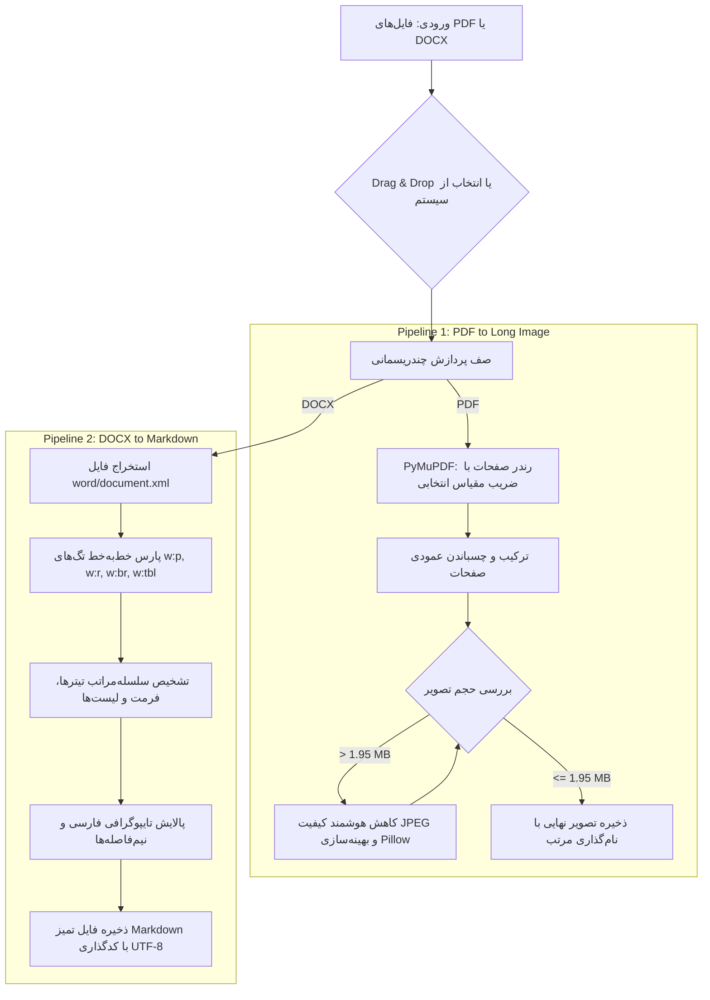

<div align="center">

# 📄 استودیو PDF2MD | PDF2MD Studio
### 🚀 تبدیل هوشمند و یکپارچه اسناد: از PDF به تصاویر فوق‌عریض تا استخراج Markdown استاندارد از OCR

[](README_en.md)
[](README.md)

<p align="center">
  
  
  
  
  
</p>

---

</div>

## 🌟 درباره پروژه

**استودیو PDF2MD (PDF2MD Studio)** یک نرم‌افزار دسکتاپ مدرن، سریع و تخصصی است که برای حل دو چالش بزرگ در کار با اسناد دیجیتال توسعه یافته است:

1. **تبدیل هوشمند فایل‌های چندصفحه‌ای PDF به تصاویر متوالی، طویل و باکیفیت بالا (Stitched Long Images)** با کنترل پیشرفته حجم زیر ۲ مگابایت بدون افت وضوح متن.
2. **استخراج، پاکسازی و استانداردسازی متون نامنظم DOCX (حاصل از اسکن و OCR گوگل داکس) به فرمت منظم Markdown** با پشتیبانی بی‌نقص از تایپوگرافی فارسی، نیم‌فاصله‌ها و تشخیص هوشمند سلسله‌مراتب تیترها.

تمام این قابلیت‌ها در یک رابط کاربری مینیمال، مدرن با پشتیبانی از **حالت تاریک و روشن (Dark/Light)** و قابلیت **بکش و رها کن (Drag & Drop)** در اختیار شما قرار دارد.

---

## 🔄 گردش کار ۳ مرحله‌ای (چگونه کار می‌کند؟)

از آنجا که ابزارهای معمول OCR برای کتاب‌های درسی پیچیده (مخصوصاً زبان فارسی) اغلب پولی یا دارای خطای بالا هستند، استودیو PDF2MD به عنوان یک "پل" عمل می‌کند تا شما بتوانید از موتور قدرتمند OCR گوگل کاملاً رایگان استفاده کنید:

1. **فاز اول (نرم‌افزار):** فایل PDF کتاب خود را وارد برنامه می‌کنید. برنامه آن را به تصاویر طویل عمودی برش داده و به شکلی هوشمندانه فشرده می‌کند تا دقیقاً زیر محدودیت ۲ مگابایتی گوگل بماند (بدون تار شدن متن).
2. **فاز دوم (پل گوگل):** تصاویر خروجی را در Google Drive آپلود کرده، روی آن‌ها کلیک راست نموده و گزینه **"Open with Google Docs"** را انتخاب می‌کنید. سرورهای قدرتمند گوگل بلافاصله تصویر را اسکن کرده و تمام متن را در یک فایل `.docx` استخراج می‌کنند. سپس این فایل‌های DOCX را دانلود می‌کنید.
3. **فاز سوم (نرم‌افزار):** فایل‌های DOCX نامنظم گوگل داکس را دوباره به برنامه (Drag & Drop) می‌کشید. برنامه فایل‌ها را پاکسازی کرده، مشکلات تایپوگرافی و نیم‌فاصله‌های فارسی را کاملاً اصلاح می‌کند، تیترها را تشخیص می‌دهد و در نهایت یک فایل `.md` (مارک‌داون) بسیار تمیز و آماده برای هوش مصنوعی (مانند ChatGPT یا Gemini) به شما تحویل می‌دهد.

---

## ⚡ قابلیت‌های کلیدی

### 🖼️ گام اول: تبدیل PDF به تصویر طویل (Long Image Stitcher)
* **چسباندن عمودی صفحات:** ترکیب خودکار چندین صفحه PDF در یک تصویر یکپارچه و خوانا.
* **فشرده‌سازی تطبیقی بدون تاری (Smart Adaptive Compression):** الگوریتم هوشمند حفظ کیفیت متن؛ با کاهش تدریجی کیفیت فشرده‌سازی JPEG و بهره‌گیری از بهینه‌سازی داخلی Pillow، حجم تصویر زیر **۲ مگابایت** باقی می‌ماند بدون اینکه ابعاد فیزیکی تصویر کوچک و متن‌ها تار شوند.
* **تقسیم‌بندی بخش‌ها (Page Chunking):** امکان تنظیم قطعه‌بندی خودکار اسناد (مثلاً تقسیم فایل‌های حجیم به پارت‌های ۱۰، ۲۰ یا ۳۰ صفحه‌ای).
* **انتخاب رزولوشن:** پشتیبانی از کیفیت استاندارد (1.0x - 96 DPI)، متعادل (1.15x - 110 DPI)، کیفیت بالا (1.33x - 128 DPI) و فوق‌شارپ (1.75x - 168 DPI).
* **پشتیبانی از فرمت‌های JPG و PNG.**

### 📝 گام دوم: تبدیل پیشرفته DOCX/OCR به مارک‌داون (OCR to Markdown Engine)
* **پارس مستقیم ساختار XML اسناد:** بدون نیاز به API یا ابزارهای سنگین متفرقه، مستقیماً تگ‌های WordprocessingML را تحلیل می‌کند.
* **تشخیص شکستگی‌های نرم خطوط (`<w:br>` و `<w:tab>`):** برخلاف مبدل‌های مرسوم که خطوط چندگانه OCR را به هم می‌چسبانند، PDF2MD تمام خطوط را مجزا استخراج کرده و خط‌به‌خط اعتبارسنجی می‌کند.
* **تشخیص خودکار ساختار محتوا:**
  - تبدیل خودکار تیترهای اصلی (`# فصل`) و فرعی (`## گفتار`، `### فعالیت`).
  - تشخیص لیست‌های نشانه‌دار (`-`) و شماره‌گذاری‌ها.
  - استخراج جداول و جعبه‌های متنی (Textboxes & Drawings).
  - حفظ فرمت‌های **Bold** و *Italic*.
* **اصلاح خودکار تایپوگرافی فارسی:**
  - اعمال صحیح نیم‌فاصله‌ها (مانند «می‌شود»، «یاخته‌ها»، «پدیده‌های»).
  - تصحیح کدهای نویسه‌های عربی به فارسی (ي/ک).
  - پاکسازی فاصله‌های غیرمجاز قبل از علائم نگارشی نظیر نقطه‌ها، ویرگول‌ها و پرانتزها.

### 🖱️ تجربه کاربری مدرن (UX/UI)
* **پشتیبانی سراسری از Drag & Drop:** کشیدن مستقیم فایل‌های PDF، DOCX، ZIP یا پوشه‌های حاوی اسناد به داخل برنامه.
* **نمای هوشمند Empty State:** نمایش ناحیه دریافت فایل هنگام خالی بودن صف و تغییر خودکار به جدول مدیریت فایل‌ها.
* **پردازش چندریسمانی (Multi-threaded):** رابط کاربری در حین تبدیل اسناد سنگین هرگز قفل نمی‌شود.
* **کنسول رویدادها و نوار پیشرفت زنده:** مشاهده وضعیت لحظه‌ای پردازش، خطایابی و حجم فایل‌های ذخیره شده.

---

## 📊 مقایسه عملکرد

| ویژگی | مبدل‌های معمولی آنلاین / ابزارهای رایج | استودیو PDF2MD (PDF2MD Studio) |
| :--- | :---: | :---: |
| **کیفیت متن هنگام زوم** | ❌ اغلب تار با کاهش سایز تصویر | ✅ شفاف و شارپ با الگوریتم حفظ DPI |
| **محدودیت حجم ۲ مگابایت** | ❌ حجم بالا یا افت شدید کیفیت | ✅ تضمین حجم زیر ۲ مگابایت با بهینه‌سازی هوشمند |
| **حفظ ساختار متون OCR** | ❌ ادغام اشتباه خطوط و از دست رفتن تیترها | ✅ پارس خط‌به‌خط با بازسازی کامل ساختار |
| **تایپوگرافی و نیم‌فاصله فارسی** | ❌ متون به‌هم‌ریخته با فونت نامناسب | ✅ اصلاح و استانداردسازی خودکار تمام واژگان |
| **حریم خصوصی و آفلاین بودن** | ❌ ارسال اسناد به سرورهای ابری | ✅ ۱۰۰٪ آفلاین و محلی روی سیستم شما |
| **کشیدن و رها کردن (Drag & Drop)** | ⚠️ محدود | ✅ پشتیبانی از فایل تکی، چندگانه و کل پوشه |

---

## 🏗️ معماری پایپ‌لاین پردازش



---

## 💻 راهنمای نصب و اجرا

### ۱. پیش‌نیازها
مطمئن شوید پایتون (نسخه ۳.۹ یا بالاتر) روی سیستم شما نصب و به PATH سیستم اضافه شده است.

### ۲. کلون و راه‌اندازی مخزن

```bash
# دریافت مخزن
git clone https://github.com/your-username/pdf2md-studio.git
cd pdf2md-studio

# ساخت و فعال‌سازی محیط مجازی (اختیاری اما پیشنهادی)
python -m venv venv
# در ویندوز:
.\venv\Scripts\activate
# در لینوکس/مک:
source venv/bin/activate

# نصب وابستگی‌ها
pip install -r requirements.txt
```

### ۳. اجرای نرم‌افزار

* **روش اول (توصیه‌شده برای ویندوز):** دوبار کلیک روی فایل `run_app.bat`
* **روش دوم (ترمینال):**
  ```bash
  python pdf_to_long_img_app.py
  ```
  یا
  ```bash
  python ui.py
  ```

---

## 📂 ساختار فایل‌های پروژه

```plaintext
├── config_manager.py        # مدیریت تنظیمات و ذخیره‌سازی ترجیحات کاربر
├── models.py                # مدل‌های داده‌ای مربوط به صف پردازش PDF و DOCX
├── pdf_processing.py        # موتور رندر، چسباندن و فشرده‌سازی هوشمند تصاویر
├── text_processing.py       # موتور پارس XML، استخراج متن و پالایش تایپوگرافی
├── ui.py                    # رابط کاربری گرافیکی با CustomTkinter و DnD
├── pdf_to_long_img_app.py   # نقطه ورود اصلی برنامه
├── publish.py               # اسکریپت انتشار امن ۱-کلیکه در گیت‌هاب
├── publish_github.bat       # اجرای سریع اسکریپت انتشار
├── run_app.bat              # اجرای بی‌سر و صدای برنامه در پس‌زمینه
├── requirements.txt         # لیست بسته‌های پایتونی مورد نیاز
├── README.md                # مستندات فارسی (پیش‌فرض)
└── README_en.md             # مستندات انگلیسی
```

---

## 🚀 ابزار انتشار خودکار در گیت‌هاب (Publish Tool)

برای توسعه‌دهندگان، اسکریپت `publish_github.bat` در نظر گرفته شده است که با یک کلیک:
1. وضعیت Git و مخزن متصل را بررسی می‌کند.
2. از عدم انتشار ناخواسته فایل‌های حجیم تست (پوشه `biology`) یا کلیدها اطمینان حاصل می‌کند.
3. تغییرات را کامیت و در برنچ فعال پوش می‌کند.
4. فایل ZIP نسخه تمیز (Release Package) را به‌صورت خودکار در ریشه پروژه تولید می‌کند.

---

> [!TIP]
> **نکته کاربردی:** برای دریافت بیشترین وضوح در کتاب‌های درسی و اسناد پرجزئیات، گزینه **Ultra Sharp (1.75x)** را از منوی کیفیت انتخاب کنید. موتور فشرده‌سازی هوشمند PDF2MD به‌طور خودکار حجم خروجی را برای شما کنترل خواهد کرد.

> [!NOTE]
> این پروژه کاملاً آفلاین و متکی به پایتون خالص است و هیچ وابستگی به هوش مصنوعی یا APIهای پولی خارجی ندارد.

---

## 📜 مجوز (License)

این پروژه تحت مجوز **MIT** منتشر شده است. برای اطلاعات بیشتر فایل `LICENSE` را مطالعه کنید.
