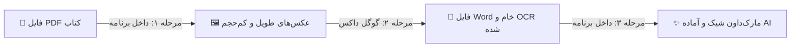

<div align="center">

# 📚 تبدیل کتاب و PDF به متن Markdown برای هوش مصنوعی
### 🚀 استودیو PDF2MD | چسباندن صفحات PDF به عکس‌های طویل + آماده‌سازی OCR گوگل داکس برای ChatGPT و Gemini

[](README_en.md)
[](README.md)

<p align="center">
  
  
  
  
  
</p>

---

</div>

> ### ⚡ کل داستان در ۱۰ ثانیه (خلاصه در یک نگاه):
> 1. **PDF کتاب رو می‌کشی توی برنامه** ⬅️ برنامه صفحاتش رو به عکس‌های طویل، شفاف و کم‌حجم (زیر ۲ مگابایت) تبدیل می‌کنه.
> 2. **عکس‌ها رو توی Google Docs باز می‌کنی** ⬅️ هوش مصنوعی گوگل به صورت کاملاً رایگان متن‌های فارسی و انگلیسی رو اسکن می‌کنه (OCR).
> 3. **فایل ورد رو می‌کشی توی برنامه** ⬅️ برنامه تمام متون به‌هم‌ریخته رو تمیز می‌کنه، تیترها و نیم‌فاصله‌ها رو مرتب می‌کنه و یک فایل مارک‌داون (`.md`) شیک برای ChatGPT یا Claude بهت تحویل میده!

---

## 🎯 چرا به این برنامه نیاز داریم؟ (حل مشکل بزرگ متون فارسی)

اگر تا به حال سعی کرده باشید کتاب‌های درسی یا فایل‌های PDF فارسی را به هوش مصنوعی بدهید، می‌دانید که:
* متن‌های کپی‌شده از PDF کاملاً به‌هم‌ریخته و غیرقابل خواندن هستند.
* سرویس‌های OCR فارسی یا پولی هستند یا پر از غلط‌های املایی.
* **گوگل داکس (Google Docs)** بهترین و دقیق‌ترین OCR فارسی دنیا را **کاملاً رایگان** دارد؛ اما فقط عکس‌های زیر ۲ مگابایت را باز می‌کند و خروجی متنی آن هم پر از خطوط چسبیده و بدون ساختار است.

**استودیو PDF2MD دقیقاً رابط میان کتاب‌های شما و OCR گوگل داکس است تا در ۳ مرحله ساده، خروجی ایده‌آل بسازید.**

---

## 🚀 آموزش تصویری و گام‌به‌گام کار با برنامه



### 1️⃣ مرحله اول: تبدیل PDF به عکس‌های مخصوص گوگل داکس
1. فایل **`run_app.bat`** را اجرا کنید تا برنامه باز شود.
2. فایل‌های PDF خود را بکشید و داخل کادر برنامه رها کنید (**Drag & Drop**).
3. روی دکمه آبی‌رنگ **Start Processing** کلیک کنید.
> [!NOTE]
> برنامه صفحات را عمودی به هم می‌چسباند و حجم آن را زیر ۲ مگابایت نگه می‌دارد تا گوگل داکس بدون هیچ خطایی آن را باز کند.

---

### 2️⃣ مرحله دوم: اسکن رایگان با Google Docs
1. وارد [Google Drive](https://drive.google.com) شوید و عکس‌های تولید شده را آپلود کنید.
2. روی عکس کلیک راست کرده و گزینه **Open with > Google Docs** را بزنید.
3. چند ثانیه صبر کنید تا گوگل متن را اسکن کرده و زیر عکس قرار دهد.
4. از منوی بالا: **File > Download > Microsoft Word (.docx)** را بزنید تا فایل متنی دانلود شود.

---

### 3️⃣ مرحله سوم: تمیزکاری و ساخت فایل مارک‌داون (Markdown)
1. فایل‌های `.docx` دانلود شده را بکشید و داخل پنجره برنامه بیندازید (**Drag & Drop**).
2. روی دکمه **Start Processing** کلیک کنید.
3. **تمام شد!** 🎉 فایل‌های نهایی با پسوند `.md` در پوشه خروجی شما ذخیره شده‌اند.
> [!TIP]
> برنامه به طور خودکار تمام نیم‌فاصله‌ها («می‌شود»، «کتاب‌ها»)، تیترهای اصلی (`# فصل`) و فرعی (`## گفتار`) و جدول‌ها را با استانداردترین حالت ممکن تنظیم می‌کند.

---

## 🤖 چگونه متن خروجی را به هوش مصنوعی بدهیم؟

کافیست متن فایل `.md` را کپی کرده و به همراه یکی از درخواست‌های زیر به ChatGPT یا Claude بدهید:

```text
متن زیر از کتاب درسی به فرمت استاندارد استخراج شده است. 
لطفاً نکات کنکوری، تعاریف اصلی و یک خلاصه طبقه‌بندی شده از این بخش برای من بنویس:

[متن فایل md را اینجا Paste کنید]
```

---

## ⚡ مقایسه با روش‌های دیگر

| قابلیت | مبدل‌های معمولی اینترنتی | استودیو PDF2MD |
| :--- | :---: | :---: |
| **کیفیت متن فارسی** | ❌ پر از حروف عربی و بدون نیم‌فاصله | ✅ ۱۰۰٪ استاندارد و اصلاح‌شده |
| **کنترل هوشمند حجم** | ❌ بالای ۲ مگابایت (رد شدن توسط گوگل) | ✅ تضمین زیر ۲ مگابایت بدون تاری متن |
| **حفظ تیترها و ساختار** | ❌ متن یکدست و چسبیده | ✅ تشخیص خودکار تیترها و شماره‌گذاری‌ها |
| **امنیت و حریم شخصی** | ❌ آپلود فایل‌ها روی سایت‌های متفرقه | ✅ پردازش ۱۰۰٪ آفلاین روی سیستم شما |
| **کاربری آسان** | ⚠️ نیاز به تنظیمات پیچیده | ✅ کارکرد با کشیدن و رها کردن (Drag & Drop) |

---

## 💻 راهنمای اجرا در ویندوز (بدون دردسر)

1. مطمئن شوید پایتون (نسخه ۳.۹ به بالا) روی سیستمتان نصب است.
2. روی فایل **`run_app.bat`** دوبار کلیک کنید. برنامه فوراً اجرا می‌شود!

*(توسعه‌دهندگان می‌توانند از دستور `python ui.py` در ترمینال نیز استفاده کنند).*

---

## 📜 مجوز (License)

این نرم‌افزار کاملاً **رایگان و متن‌باز (MIT License)** است. می‌توانید بدون هیچ محدودیتی از آن برای پروژه‌ها و مطالعه خود استفاده کنید.
