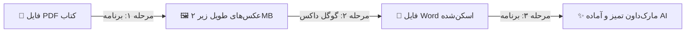

<div align="center">

# 📚 تبدیل کتاب و PDF به متن تمیز برای هوش مصنوعی
### 🚀 استودیو PDF2MD | چسباندن صفحات PDF به عکس‌های طویل + آماده‌سازی OCR گوگل داکس برای ChatGPT و Gemini

[](README_en.md)
[-emerald?style=for-the-badge&logo=translate&logoColor=white)](README.md)

<p align="center">
  
  
  
  
  
  
  
  
</p>

---

</div>

> ### ⚡ خلاصه کل فرآیند در ۱۰ ثانیه:
> * 📥 **گام ۱ (برنامه):** فایل `PDF` کتاب را داخل برنامه می‌اندازید ➔ صفحات به عکس‌های طویل، شفاف و کم‌حجم (زیر ۲ مگابایت) تبدیل می‌شوند.
> * 🔍 **گام ۲ (گوگل داکس):** عکس‌ها را در `Google Docs` باز می‌کنید ➔ هوش مصنوعی گوگل تمام متن‌های فارسی را به صورت رایگان اسکن می‌کند (`OCR`).
> * ✨ **گام ۳ (برنامه):** فایل ورد دانلود شده را داخل برنامه می‌اندازید ➔ متن تمیز، تیترها و نیم‌فاصله‌ها اصلاح شده و فایل `Markdown` آماده تحویل داده می‌شود!

---

## 🎯 چرا به این برنامه نیاز داریم؟ (حل چالش متون فارسی)

اگر تا به حال سعی کرده باشید کتاب‌های درسی، جزوات یا اسناد `PDF` فارسی را به هوش مصنوعی بدهید:
* ❌ کپی کردن مستقیم از `PDF` متن را کاملاً به‌هم‌ریخته، برعکس و نامفهوم می‌کند.
* ❌ سرویس‌های تبدیل آنلاین، متن فارسی را پر از غلط‌های املایی، حروف عربی و بدون نیم‌فاصله تحویل می‌دهند.
* 🌐 **گوگل داکس (`Google Docs`)** قوی‌ترین `OCR` رایگان زبان فارسی در دنیا است؛ اما فقط عکس‌های زیر ۲ مگابایت را قبول می‌کند و خروجی متنی آن هم پر از خطوط شکسته است.

**💡 استودیو `PDF2MD` دقیقاً حلقه گمشده میان اسناد شما و هوش مصنوعی است تا با کمترین زحمت، بهترین خروجی را بسازید.**

---

## 🚀 آموزش تصویری و گام‌به‌گام کاربری



### 1️⃣ مرحله اول: ساخت عکس‌های بهینه از فایل PDF
* 📂 فایل `run_app.bat` را اجرا کنید تا برنامه باز شود.
* 🖱️ فایل‌های `PDF` کتاب یا جزوه را با ماوس بکشید و داخل کادر برنامه رها کنید (`Drag & Drop`).
* ▶️ روی دکمه آبی **Start Processing** کلیک کنید.
> [!NOTE]
> 🧩 برنامه صفحات را عمودی به هم می‌چسباند و با الگوریتم فشرده‌سازی تطبیقی، حجم آن را زیر ۲ مگابایت نگه می‌دارد تا گوگل داکس بدون ارور آن را باز کند.

---

### 2️⃣ مرحله دوم: استخراج رایگان متن با گوگل داکس
* ☁️ وارد سایت [Google Drive](https://drive.google.com) شوید و عکس‌های تولید شده را آپلود کنید.
* 📄 روی هر عکس راست‌کلیک کرده و گزینه **Open with > Google Docs** را بزنید.
* ⏳ چند ثانیه صبر کنید تا متن اسکن‌شده زیر عکس ظاهر شود.
* 💾 از منوی بالای گوگل داکس: مسیر **File > Download > Microsoft Word (.docx)** را بزنید تا فایل ذخیره شود.

---

### 3️⃣ مرحله سوم: پاکسازی و ساخت فایل Markdown
* 📥 فایل‌های `.docx` دانلود شده را داخل پنجره برنامه بیندازید (`Drag & Drop`).
* ⚙️ روی دکمه **Start Processing** کلیک کنید.
* 🎉 **تمام شد!** فایل‌های نهایی `.md` در پوشه خروجی ذخیره شده و آماده استفاده در ChatGPT هستند.
> [!TIP]
> ✍️ برنامه به صورت خودکار تمام نیم‌فاصله‌ها («می‌شود»، «کتاب‌ها»)، تیترهای اصلی (`# فصل`)، تیترهای فرعی (`## گفتار`) و جدول‌ها را با فرمت استاندارد کدگذاری می‌کند.

---

## 🤖 نمونه پرامپت‌های کاربردی برای هوش مصنوعی

کافیست متن فایل `.md` را کپی کرده و به همراه یکی از درخواست‌های زیر به `ChatGPT`، `Claude` یا `Gemini` بفرستید:

### 📌 خلاصه و نکات کلیدی:
```text
متن زیر از کتاب درسی استخراج شده است. 
لطفاً نکات کلیدی، تعاریف اصلی و یک خلاصه طبقه‌بندی شده از این مبحث برای من بنویس:

[متن فایل md را اینجا Paste کنید]
```

### 📌 طراحی سوالات تستی و کنکوری:
```text
بر اساس متن زیر، ۵ سوال چهارگزینه‌ای مفهومی همراه با پاسخ تشریحی و ذکر شماره بخش طراحی کن:

[متن فایل md را اینجا Paste کنید]
```

---

## ⚡ جدول مقایسه قابلیت‌ها

| قابلیت | ابزارهای آنلاین متفرقه | استودیو PDF2MD 🚀 |
| :--- | :---: | :---: |
| 🔤 **کیفیت متن و نیم‌فاصله‌ها** | ❌ پر از غلط و حروف عربی | ✅ ۱۰۰٪ استاندارد با نیم‌فاصله («می‌شود») |
| 🗜️ **کنترل هوشمند حجم عکس** | ❌ حجم بالا یا تاری متن | ✅ تضمین زیر ۲ مگابایت با حفظ رزولوشن |
| 📑 **حفظ تیترها و جدول‌ها** | ❌ متن یکدست و چسبیده | ✅ ساختاردهی خودکار تیترها (`#` و `##`) |
| 🔒 **امنیت و حریم شخصی** | ❌ آپلود روی سرورهای ناشناس | ✅ پردازش ۱۰۰٪ آفلاین و محلی روی سیستم |
| 🖱️ **سهولت استفاده** | ⚠️ مراحل دستی پیچیده | ✅ پشتیبانی کامل از Drag & Drop |

---

## 💻 راهنمای اجرا در ویندوز

1. 🐍 مطمئن شوید **پایتون (نسخه ۳.۹ به بالا)** روی سیستم شما نصب است.
2. ⚡ روی فایل **`run_app.bat`** دوبار کلیک کنید تا برنامه اجرا شود.

---

## 📜 مجوز (License)

این نرم‌افزار کاملاً **رایگان و متن‌باز (MIT License)** است.
