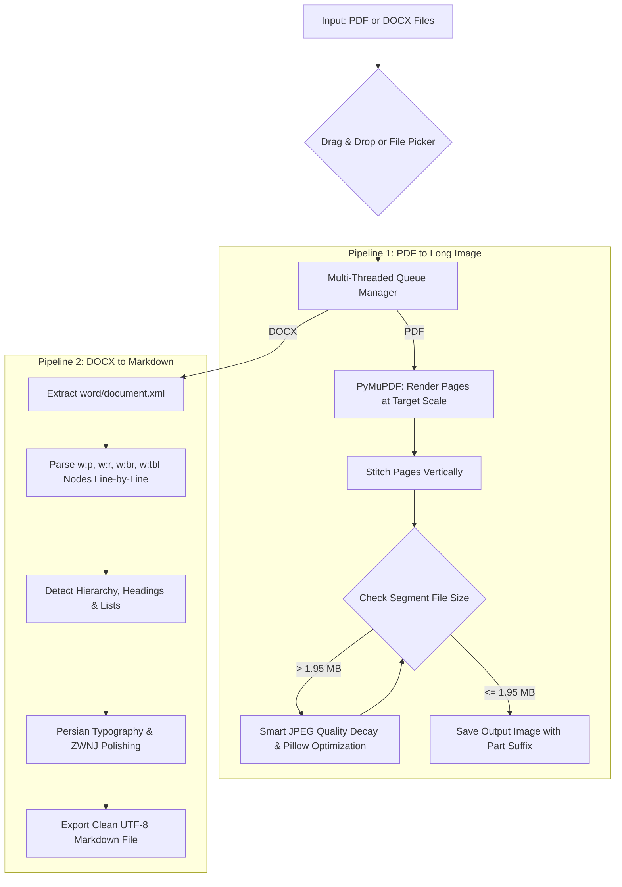

<div align="center">

# 📚 PDF to AI-Ready Markdown Studio
### 🚀 PDF2MD Studio | Convert Textbook PDFs into Long Images + Prepare Free Google Docs OCR for ChatGPT & Claude

[](README_en.md)
[](README.md)

<p align="center">
  
  
  
  
  
</p>

---

</div>

> ### ⚡ The Entire Workflow in 10 Seconds:
> 1. **Drop your PDF into the app** ⬅️ It converts the pages into vertical, high-res continuous images under 2MB.
> 2. **Open images in Google Docs** ⬅️ Google AI runs free, world-class OCR on Persian & English text. Download as DOCX.
> 3. **Drop the DOCX back into the app** ⬅️ It cleans the OCR mess, fixes Persian typography (ZWNJ), and outputs immaculate, AI-ready Markdown (`.md`)!

## 🌟 Overview

**PDF2MD Studio** is a unified, high-performance desktop application designed to solve two major digital document challenges:

1. **Stitching multi-page PDFs into continuous high-resolution long images** while strictly keeping file sizes under **2MB** without sacrificing text sharpness or resolution.
2. **Transforming messy DOCX files (from OCR tools or Google Docs) into immaculate Markdown**, with full native XML parsing, line-by-line validation, and automated Persian typography formatting (including ZWNJ / نیم‌فاصله).

Built with a sleek **CustomTkinter** interface, native **Drag & Drop** support, and responsive Dark/Light themes, PDF2MD Studio handles complex processing smoothly in background worker threads.

---

## 🔄 The 3-Step AI Workflow (How it Works)

Since traditional OCR for complex textbooks (especially Persian) is often expensive or highly inaccurate, PDF2MD Studio acts as a "bridge" to let you use Google's world-class OCR engine for free:

1. **Phase 1 (The App):** You feed it your PDF textbook. The app smartly slices it into long vertical images, perfectly compressing them to stay just under Google's 2MB limit without blurring the text.
2. **Phase 2 (The Google Bridge):** You upload those images to Google Drive, right-click, and select **"Open with Google Docs"**. Google's massive AI servers instantly scan the image and dump all the OCR text into a `.docx` file for you. You download those DOCX files.
3. **Phase 3 (The App):** You drag those raw, messy DOCX files back into the app. The app goes to work stripping out the garbage, fixing the broken Persian typography (like adding proper half-spaces / نیم‌فاصله‌ها), detecting the headings, and exporting a pristine `.md` (Markdown) file ready for ChatGPT or Gemini.

---

## ⚡ Key Features

### 🖼️ Step 1: PDF to Long Image Stitcher
* **Vertical Page Stitching:** Combines multi-page PDFs into vertically aligned, high-resolution continuous scrolls.
* **Smart Adaptive Compression:** Quality-first compression algorithm. Rather than physically downsampling image dimensions (which blurs text), it gradually optimizes JPEG encoding parameters and leverages Pillow internal compression to guarantee images stay under **2MB** with razor-sharp readability.
* **Segment / Page Chunking:** Easily configure chunk sizes (e.g., split long documents into 10, 20, or 30-page parts).
* **Multiple Quality Presets:** Standard (1.0x - 96 DPI), Balanced (1.15x - 110 DPI), High Quality (1.33x - 128 DPI), and Ultra Sharp (1.75x - 168 DPI).
* **Format Flexibility:** Export directly to JPG or lossless PNG.

### 📝 Step 2: OCR / DOCX to Clean Markdown Engine
* **Native WordprocessingML XML Parser:** Deep parsing directly from `word/document.xml` with zero reliance on cloud APIs or heavy third-party wrappers.
* **Soft Break & Tab Support (`<w:br>` and `<w:tab>`):** Accurately splits and parses multi-line OCR paragraphs line-by-line, preventing merged headings or clobbered lines.
* **Intelligent Hierarchy & Structure Detection:**
  - Automatically identifies main chapters (`# فصل`) and sub-sections (`## گفتار`, `### فعالیت`).
  - Converts bullet points (`-`) and nested numbered lists.
  - Extracts tables (`w:tbl`), text boxes, and drawings without data loss.
  - Preserves **Bold** and *Italic* text spans cleanly.
* **Persian Typography & ZWNJ Polisher:**
  - Auto-normalizes Zero-Width Non-Joiners (نیم‌فاصله) for prefixes and suffixes (e.g., «می‌شود», «یاخته‌ها»).
  - Standardizes Arabic characters (ي/ك) to native Persian glyphs.
  - Fixes punctuation spacing rules.

### 🖱️ Modern User Experience (UX/UI)
* **Universal Drag & Drop:** Drop individual `.pdf`, `.docx`, `.zip` files or entire directories directly into the app window.
* **Intuitive Empty State:** Clean drop-zone overlay when the queue is empty, automatically transitioning into the queue manager.
* **Multi-threaded Background Workers:** The interface stays 100% responsive during intensive rendering and extraction tasks.
* **Live Console & Progress Bar:** Real-time feedback showing file sizes, processed parts, and detailed logs.

---

## 📊 Comparison Matrix

| Feature | Conventional Online Tools | PDF2MD Studio |
| :--- | :---: | :---: |
| **Zoomed Text Sharpness** | ❌ Often blurry due to downscaling | ✅ Sharp & readable with adaptive DPI retention |
| **Strict 2MB Size Limit** | ❌ Exceeds size or destroys quality | ✅ Guaranteed < 2MB via smart compression |
| **OCR Multi-line Handling** | ❌ Merges lines & loses headings | ✅ Line-by-line XML parsing with soft-break support |
| **Persian Typography & ZWNJ** | ❌ Disorganized with broken characters | ✅ Full automatic normalization & polishing |
| **Privacy & Offline Security** | ❌ Uploads documents to cloud servers | ✅ 100% Offline, Local & Private |
| **Drag & Drop Workflow** | ⚠️ Limited | ✅ Full file, multi-selection & folder support |

---

## 🏗️ Architecture Pipeline



---

## 💻 Installation & Quick Start

### 1. Prerequisites
Ensure **Python 3.9+** is installed and accessible from your system PATH.

### 2. Clone & Setup Repository

```bash
# Clone the repository
git clone https://github.com/your-username/pdf2md-studio.git
cd pdf2md-studio

# Create & activate a virtual environment (optional but recommended)
python -m venv venv
# On Windows:
.\venv\Scripts\activate
# On Linux/macOS:
source venv/bin/activate

# Install dependencies
pip install -r requirements.txt
```

### 3. Run the Application

* **Option A (Recommended for Windows):** Double-click `run_app.bat`
* **Option B (Terminal):**
  ```bash
  python pdf_to_long_img_app.py
  ```
  or
  ```bash
  python ui.py
  ```

---

## 📂 Project Structure

```plaintext
├── config_manager.py        # Settings management & JSON preference storage
├── models.py                # Data classes for PDF & DOCX queue items
├── pdf_processing.py        # PDF rendering, stitching & adaptive compression engine
├── text_processing.py       # XML parsing, markdown extraction & typography polisher
├── ui.py                    # CustomTkinter GUI & Drag-and-Drop implementation
├── pdf_to_long_img_app.py   # Main application entry point
├── publish.py               # 1-Click safe GitHub publisher & release archiver
├── publish_github.bat       # Quick batch launcher for publishing
├── run_app.bat              # Silent background app launcher
├── requirements.txt         # Project dependencies
├── README.md                # Persian documentation (Default)
└── README_en.md             # English documentation
```

---

## 🚀 1-Click GitHub Publisher

For developers, running `publish_github.bat` executes the automated publisher:
1. Validates Git repository configuration and origin remote.
2. Safely excludes test assets (e.g. `biology/` folder) and local credentials.
3. Automatically commits with a custom or timestamped message and pushes to your active branch.
4. Generates a clean release archive (`PDF2MD_Studio_Release.zip`) ready for distribution.

---

> [!TIP]
> **Pro Tip:** For maximum clarity on textbook scans and fine print, set the resolution to **Ultra Sharp (1.75x)** in the sidebar. PDF2MD Studio will automatically optimize the image compression behind the scenes to keep the output under 2MB.

> [!NOTE]
> This application runs 100% locally on pure Python with no external AI or cloud API dependencies.

---

## 📜 License

This project is licensed under the **MIT License**. See the `LICENSE` file for more details.
