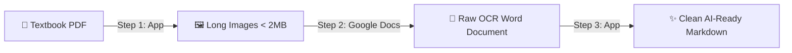

<div align="center">

# 📚 PDF to AI-Ready Markdown Studio
### 🚀 PDF2MD Studio | Convert Textbook PDFs into Long Images + Prepare Free Google Docs OCR for ChatGPT & Claude

[](README_en.md)
[-emerald?style=for-the-badge&logo=translate&logoColor=white)](README.md)

<p align="center">
  
  
  
  
  
  
  
  
</p>

---

</div>

> ### ⚡ The Entire Workflow in 10 Seconds:
> * 📥 **Step 1 (The App):** Drop your `PDF` textbook into the app ➔ Converts pages into continuous, crisp long images under 2MB.
> * 🔍 **Step 2 (Google Docs):** Open images in `Google Docs` ➔ Google AI runs free, world-class OCR on Persian & English text. Download as DOCX.
> * ✨ **Step 3 (The App):** Drop the DOCX back into the app ➔ Automatically cleans the mess, fixes typography (ZWNJ), and outputs AI-ready Markdown (`.md`)!

---

## 🎯 Why PDF2MD Studio?

When giving textbook PDFs to LLMs (like ChatGPT, Claude, or Gemini):
* ❌ Direct copy-pasting produces broken lines, scrambled bidirectional Persian text, and lost tables.
* ❌ Commercial OCR APIs are costly.
* 🌐 **Google Docs** provides the world's most accurate free Persian & multilingual OCR, but limits uploads to 2MB images and produces unstructured raw text.

**💡 PDF2MD Studio bridges this entire pipeline locally and automatically.**

---

## 🚀 3-Step Visual Guide



### 1️⃣ Step 1: Generate Optimized Long Images from PDF
* 📂 Launch the app via `run_app.bat`.
* 🖱️ Drag and drop your `PDF` files or directories into the window.
* ▶️ Click **Start Processing**.
> [!NOTE]
> 🧩 The app stitches pages vertically and adaptively compresses images to ensure they stay strictly under 2MB while preserving razor-sharp text.

---

### 2️⃣ Step 2: Free OCR via Google Docs
* ☁️ Upload the generated images to [Google Drive](https://drive.google.com).
* 📄 Right-click an image ➔ **Open with > Google Docs**.
* ⏳ Wait a few seconds for Google's OCR engine to transcribe the text.
* 💾 Go to **File > Download > Microsoft Word (.docx)**.

---

### 3️⃣ Step 3: Polish & Export Final Markdown
* 📥 Drag and drop the downloaded `.docx` files into the app.
* ⚙️ Click **Start Processing**.
* 🎉 **Done!** Pristine `.md` files will be saved in your output folder.
> [!TIP]
> ✍️ The app automatically reconstructs heading hierarchies (`# Chapter`, `## Section`), normalizes Persian Zero-Width Non-Joiners (`می‌شود`, `کتاب‌ها`), parses tables, and strips OCR artifacts.

---

## 🤖 Example AI Prompts

Copy your `.md` content and feed it directly into `ChatGPT` or `Claude`:

```text
The following text is clean Markdown extracted from a textbook. 
Please extract key takeaways, core definitions, and structured study notes:

[Paste your .md content here]
```

---

## ⚡ Feature Comparison

| Feature | Generic Online Converters | PDF2MD Studio 🚀 |
| :--- | :---: | :---: |
| 🔤 **Persian Typography (ZWNJ)** | ❌ Disconnected & broken | ✅ 100% Native standard formatting |
| 🗜️ **Smart 2MB Compression** | ❌ Exceeds limit or blurs text | ✅ Guaranteed < 2MB with sharp DPI |
| 📑 **Structure & Heading Detection** | ❌ Flat unformatted text | ✅ Auto `#` and `##` Markdown headings |
| 🔒 **Privacy & Security** | ❌ Uploaded to unknown servers | ✅ 100% Offline & local processing |
| 🖱️ **User Experience** | ⚠️ Complex manual steps | ✅ Seamless Drag & Drop support |

---

## 💻 Quick Start (Windows)

1. 🐍 Ensure **Python 3.9+** is installed on your system.
2. ⚡ Double-click **`run_app.bat`** to start immediately.

---

## 📜 License

This project is licensed under the **MIT License**.
